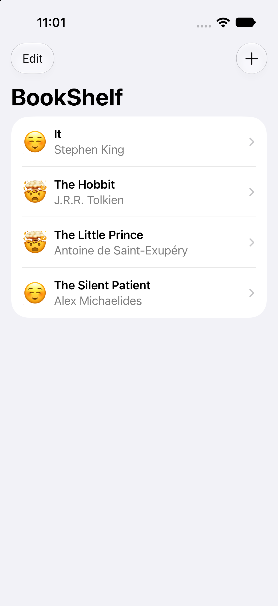
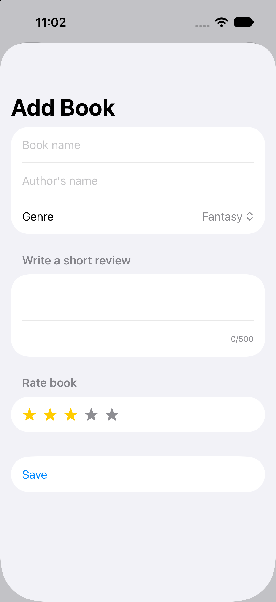
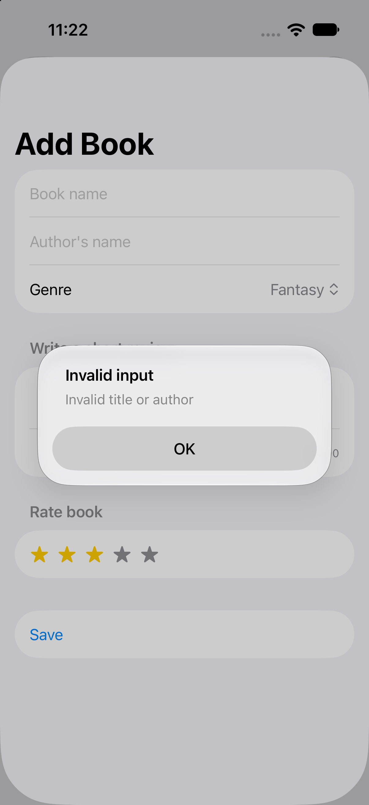
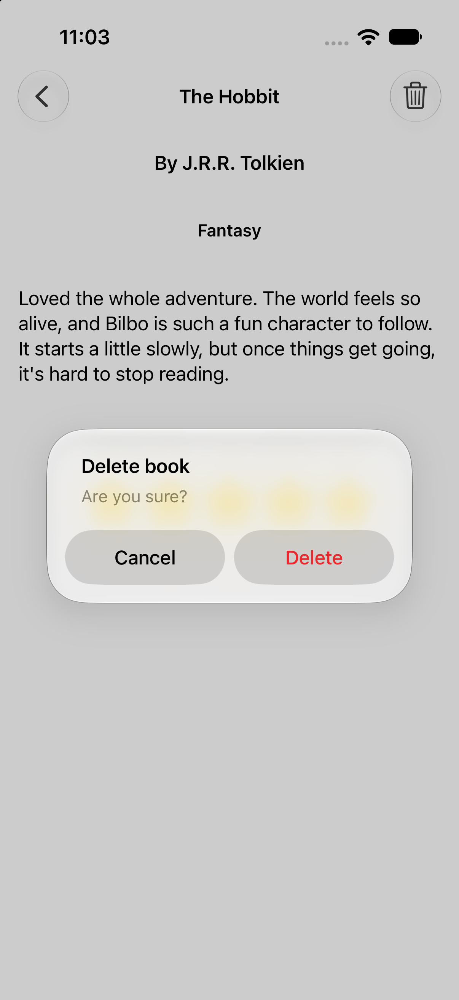

# BookShelf

A SwiftUI app for keeping a personal book catalog. Add books with a genre, short review and star rating, browse them in a list, and keep everything stored locally on the device.

> **Note:** This project is based on **Bookworm** (the SwiftData project) from [100 Days of SwiftUI](https://www.hackingwithswift.com/100/swiftui) by Paul Hudson. The original app and its core idea come from the course. See [Personal changes beyond the course](#personal-changes-beyond-the-course) for what I changed or added myself.

## Screenshots

| Book list | Add book | Validation |
|:---:|:---:|:---:|
|  |  |  |

| Book detail | Delete confirmation |
|:---:|:---:|
|  |  |

## Features

- Add a book: title, author, genre, short review (up to 500 characters, with a live counter) and a 1–5 star rating
- Book list sorted by title, then author, with an emoji that reflects the rating
- Detail screen with author, genre, review, rating and the date the book was added
- Delete a book by swiping in the list or from the detail screen (with a confirmation alert)
- Input validation: title and author can't be empty or whitespace-only
- Data is stored locally with SwiftData, so the app works fully offline

## Tech stack

- Swift, SwiftUI
- SwiftData (`@Model`, `@Query`, `ModelContext`, `SortDescriptor`)
- `NavigationStack` with value-based navigation
- Swift Testing (`@Test`, `#expect`), GitHub Actions

## Architecture

The app follows the **MV (Model–View)** pattern, the architecture SwiftData and SwiftUI are designed around: views read data with `@Query` and change it through the `ModelContext` from the environment, while the `@Model` classes hold the data and business rules. A separate view model layer is intentionally not used, because SwiftData already provides observation and persistence, and a view model would only duplicate them.

```
BookShelf/
├── MyApp.swift            App entry point, sets up the model container
├── Models/
│   ├── Book.swift         @Model class + validation (isBookValid)
│   ├── Genre.swift        Codable enum of genres
│   └── Field.swift        Focus fields for the Add Book form
└── UI/
    ├── ContentView.swift  Book list (@Query), navigation, delete
    ├── AddBookView.swift  Form, validation alert, keyboard handling
    ├── DetailView.swift   Book details, delete confirmation
    ├── RatingView.swift   Reusable star rating control (@Binding)
    └── EmojiRatingView.swift
```

- **`Book`** owns its validation rule, so the check lives with the data and not in the view.
- **`@Query`** keeps the list in sync with the database automatically.

## Testing

Unit tests are written with Swift Testing:

- **Validation:** valid book, empty title, empty author, whitespace-only input
- **Persistence:** inserting a book, deleting a book, and sorting results. These tests use an in-memory SwiftData container, so they never touch real data.

GitHub Actions builds the project and runs the tests on every push.

## Personal changes beyond the course

- **`Genre` as a `Codable` enum** instead of an array of plain strings, so invalid genres can't be stored.
- **Validation inside the model** (`isBookValid`): whitespace-only input is rejected, and the user gets an alert explaining why.
- **Review length limit** (500 characters) with a live counter under the editor.
- **Keyboard handling** with `@FocusState` and a `Field` enum, plus a "Done" button above the keyboard for the review editor.
- **Interactive star rating:** made the stars a tactile control with visual and haptic feedback (bounce animation and a haptic tick on every tap).
- **In-memory `ModelContainer`** for SwiftUI previews, so previews don't touch real data.

## Requirements

- iOS 17.0+
- Xcode 26 or later

## Running the project

1. Clone the repository
2. Open `BookShelf.xcodeproj` in Xcode
3. Select an iPhone simulator or device and press Run

## Credits

Original app concept and tutorial: [Paul Hudson, Hacking with Swift](https://www.hackingwithswift.com).
